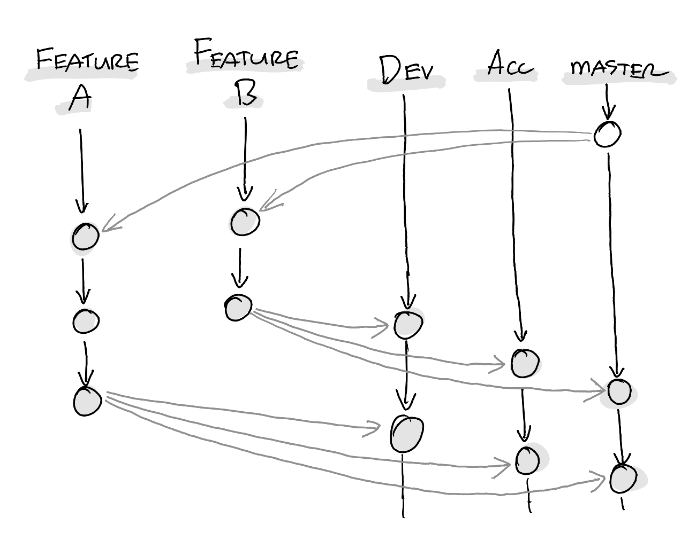

[![Contributors][contributors-shield]][contributors-url]
[![Forks][forks-shield]][forks-url]
[![Stargazers][stars-shield]][stars-url]
[![Issues][issues-shield]][issues-url]
[![MIT License][license-shield]][license-url]
[![LinkedIn][linkedin-shield]][linkedin-url]

# git-env-branches 

An NPM command-line interface for tracking merges of your Git environment and feature branches.

<!-- TABLE OF CONTENTS -->
## Table of Contents

* [About the project](#about-the-project)
* [How it works](#how-it-works)
* [Getting started](#getting-started)
    * [Prerequisites](#prerequisites)
    * [Installation](#installation)
* [How to use](#how-to-use)
    * [Check all feature branches](#check-all-feature-branches)
    * [Check all feature branches and delete merged branches interactively](#check-all-feature-branches-and-delete-merged-branches-interactively)
    * [Check all feature branches and delete ANY branches interactively](#check-all-feature-branches-and-delete-any-branches-interactively)
* [Contributing](#contributing)
* [Contact](#contact)

<!-- ABOUT THE PROJECT -->
## About the project

This NPM package is aimed at development teams who employ the so-called [environment branching strategy](https://www.wearefine.com/news/insights/env-branching-with-git/) for merging feature branches.

The basics of this strategy is that each target environment (DEV, ACC and PROD) have its own branch, and features/bugfixes/etc are merged independently from each other into these "environment branches", from which they will be deployed to their respective environments:


*Feature branches A and B, merged independently into the environment branches DEV, ACC and master. Image was drawn on a reMarkable.*

When you have a small team and few longer-than-a-day running feature branches, it is somewhat manageable to have an understanding of what features have been merged to which environment. 

However, when the team is larger and working on multiple feature branches and bugfixes simultaneously, it becomes virtually impossible to keep track of what has already been released to production, what could be released to production, and what is still in development. Especially during holidays or leaves, the risk is high that certain features never make it to production as well...

To mitigate that uncertainty, this small NPM package called `git-env-branches` was developed. For each locally available BitBucket/GitHub/GitLab repository, a developer could now check its merge state.

> NB: Its functionality is not just limited to "environment branching strategy" only. Other, more "traditiojnal" strategies such as gitflow could also benefit from it. In addition, if you are working with project branches, you could check those as well.

<!-- HOW IT WORKS -->
## How it works

Lets imagine you have a repository with three environment branches `DEV`, `ACC` and `master`.

When the CLI is executed with the three environment branches as parameters, it then outputs for every (feature) branch for that repo the last commit date, by whom, and in which environment branch these feature branches have been committed.

 * <b style="color: grey">Dark grey</b> indicates an environment branch as specified in the parameters and can thus be ignored.
 * <b>Bold white</b> indicates branches which have not yet been fully merged.
 * <b style="color: green">Green</b> indicates branches which have been fully merged throughout the specified environment branches and could be removed.
 * <b style="color: yellow">Yellow</b> indicates remote branches which have not yet been merged. This may indicate either just created branches, or stale branches (to try something out, or for no longer valid fixes, etc)
 * <b style="color: purple">Purple</b> indicates local branches only, i.e., no corresponding remote branch exists. This could indicate that a remote branch has been deleted, but the local counterpart hasn't, and could also be removed.

As you can tell from the above, having these insights is a tremendous productivity boost. 

<!-- GETTING STARTED -->
## Getting started

### Prerequisites

* NodeJS must be installed
* Any Windows, Linux or macOS laptop

### Installation

Install as global npm package:

```sh
npm install -g git-env-branches
```

Once installed, you can use both `git-env-branches` or the shorthand `geb` command.

<!-- USAGE EXAMPLES -->
## How to use

Type `git-env-branches -h` (or the shorthand `geb -h`) for all available options.

> NB 1: The following command examples assume you have a Git repo with environment branches `DEV`, `ACC` and `master`.

> NB 2: For brevity, the following examples all use the shorthand `geb` instead of `git-env-branches`.

### Check all feature branches

| Flag | Usage |
|---|---|
| `-b` or `--branches` | `geb -b <BRANCH1> <BRANCH2> <etc...>` |

For example, to check all feature branches of your current project, do the following:

1. Navigate to the root of your git repo.
2. Execute `geb -b DEV ACC master` (or `geb -b DEV ACC master`) to list all feature branches and whether they are merged into your `DEV`, `ACC` and `master` branches.

NB: While the main use case for this script is checking feature branches against environment branches, you are not limited to specify environment branches. For instance, you chould check whether feature branches are merged into *any* branch, for instance project branches or release branches:

```sh
$ geb -b project/MyAwesomeProjectBranch
```

```sh
$ geb -b release/release-2023-12-19
```

### Check all feature branches and delete merged branches interactively

| Flag | Usage |
|---|---|
| `-c` or `--cleanup` | `geb -b <BRANCH1> <BRANCH2> <etc...> -c` |

Adding the -c or --cleanup flag gives you the option to interactively delete the fully merged branches as well as the local-only branches interactively.

### Check all feature branches and delete ANY branches interactively

| Flag | Usage |
|---|---|
| `-c ALL` or `--cleanup ALL` | `geb -b <BRANCH1> <BRANCH2> <etc...> -c ALL` |

<b style="color: red">**USE THIS FLAG WITH CAUTION!**</b>

Adding the **-c ALL** or **--cleanup ALL** flag gives you the option to interactively delete *any* branch interactively.  <b style="color: red">_Be very careful when using this option!!_</b>


<!-- CONTRIBUTING -->
## Contributing

Contributions are what make the open source community such an amazing place to be learn, inspire, and create. Any contributions you make are **greatly appreciated**.

1. Fork the Project
2. Create your Feature Branch (`git checkout -b feature/AmazingFeature`)
3. Commit your Changes (`git commit -m 'Add some AmazingFeature'`)
4. Push to the Branch (`git push origin feature/AmazingFeature`)
5. Open a Pull Request


<!-- CONTACT -->
## Contact

Robin van het Hof - [@qualiture](https://twitter.com/qualiture) / [Linkedin](https://linkedin.com/in/robinvanhethof)

<!-- MARKDOWN LINKS & IMAGES -->
<!-- https://www.markdownguide.org/basic-syntax/#reference-style-links -->
[contributors-shield]: https://img.shields.io/github/contributors/qualiture/git-env-branches.svg?style=flat-square
[contributors-url]: https://github.com/qualiture/git-env-branches/graphs/contributors
[forks-shield]: https://img.shields.io/github/forks/qualiture/git-env-branches.svg?style=flat-square
[forks-url]: https://github.com/qualiture/git-env-branches/network/members
[stars-shield]: https://img.shields.io/github/stars/qualiture/git-env-branches.svg?style=flat-square
[stars-url]: https://github.com/qualiture/git-env-branches/stargazers
[issues-shield]: https://img.shields.io/github/issues/qualiture/git-env-branches.svg?style=flat-square
[issues-url]: https://github.com/qualiture/git-env-branches/issues
[license-shield]: https://img.shields.io/github/license/qualiture/git-env-branches.svg?style=flat-square
[license-url]: https://github.com/qualiture/git-env-branches/blob/master/LICENSE
[linkedin-shield]: https://img.shields.io/badge/-LinkedIn-black.svg?style=flat-square&logo=linkedin&colorB=555
[linkedin-url]: https://linkedin.com/in/robinvanhethof
